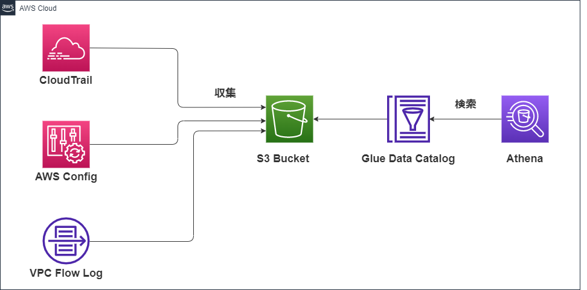
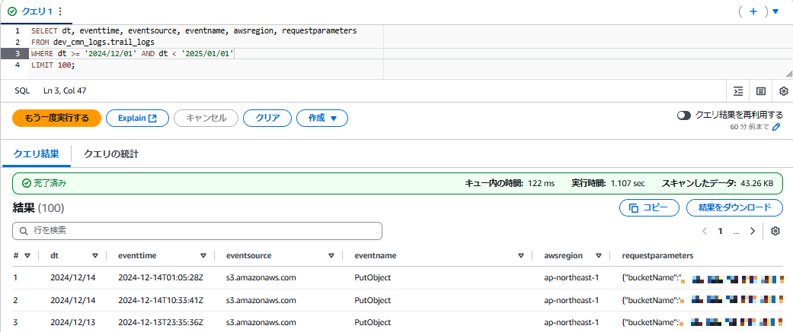

# aws-log-ops

## 概要
* AWSのログ管理基盤
* ログはS3に集約し、Glue DataCatalogでスキーマ情報を管理することでAthenaで検索できるようにしておく
* クエリ最適化とパーティションの更新を自動化のためパーティションプロジェクションの設定をDataCatalogに設定する
* CloudTrailとAWS Configを有効にする
* AWSリソースはTerraformで定義して、GitHub Actionsでデプロイする

## 構成図


## Athenaでクエリを実行する
* Athenaのクエリエディタを開き、クエリの結果の場所を `${var.aws_account_id}-${var.env}-${var.sys_name}-athena-query-result-bucket` に設定する。
* 以下はCloudTarilのログ検索の例、パーティションキーのdtを指定している。


## Terraform手順
```
# AWS credential setting
$ export AWS_ACCESS_KEY_ID=<your_access_key_id>
$ export AWS_SECRET_ACCESS_KEY=<your_secret_access_key>
$ export AWS_SESSION_TOKEN=<your_session_token>

# Terraform apply
$ docker compose run --rm terraform init
$ docker compose run --rm terraform plan -var-file=dev.tfvars
$ docker compose run --rm terraform apply -var-file=dev.tfvars
$ docker compose run --rm terraform destroy -var-file=dev.tfvars
```


